# Advancing Salary Transparency Through NLP: <br>A Comparative Study of Two Approaches for Predicting Salaries from Job Descriptions

Team Member: Zebang Li (Solo Project)

---

## 1. Introduction

### 1.1 Problem Statement and Motivation
Despite growing demands for wage transparency, only a handful of states—including California, Washington, and New York—currently mandate salary range disclosure in job postings. This leaves job seekers in most states navigating career decisions with limited compensation information. While legislative changes progress slowly, machine learning offers an immediate opportunity to bridge this information gap.

### 1.2 Project Objectives and Scope
This project aims to:
1. Develop and evaluate two distinct NLP approaches for predicting salary ranges from job descriptions
2. Compare the effectiveness of traditional ML (TF-IDF with various regressors) versus fine-tuned transformer models
3. Assess the practical applicability of these models for real-world salary prediction

## 2. Data Description and Preprocessing

To verify the effectiveness of our models, I first generate synthetic datasets with known patterns and relationships to train and test the models. This allows us to validate our models' ability to capture salary-relevant information from unstructured text.

### 2.1 Synthetic Dataset

#### 2.1.1 Data Generation Process and Assumptions

**Data Generation Architecture**

The synthetic data generator is implemented as a Python class (`SyntheticJobDataGenerator`) that produces job postings with the following key components:
- Job titles and seniority levels
- Location information
- Industry classification
- Required skills and skill categories
- Detailed job descriptions
- Salary ranges (minimum, maximum, and median)

**Key Assumptions and Rules**

1. **Salary Base Ranges**
   The base salary ranges are stratified by seniority level:
   - Entry Level: $50,000 - 80,000
   - Mid Level: $80,000 - 120,000
   - Senior: $120,000 - 180,000
   - Lead: $150,000 - 220,000
   - Executive: $200,000 - 350,000

2. **Geographic Compensation Adjustment**
   Location-based salary multipliers reflect real-world cost of living variations:
   - San Francisco: 1.30x (highest)
   - New York: 1.20x
   - Seattle: 1.15x
   - Chicago: 1.10x
   - Austin: 1.00x (baseline)

3. **Industry Impact**
   Industry-specific multipliers model sector-based compensation differences:
   - Technology: 1.20x
   - Finance: 1.15x
   - Consulting: 1.10x
   - Healthcare: 1.00x
   - Manufacturing: 0.95x
   - Retail: 0.90x
   - Hospitality: 0.85x
   - Education: 0.80x

4. **Skill-Based Compensation**
   The generator implements a sophisticated skill-based compensation model:
   - Each additional skill contributes a 3% increase to the base salary
   - Skills are categorized into domains (e.g., Software Engineering, Data & AI, Product & Management)
   - Skill categories carry different weight multipliers:
     - Data & AI: 1.30x
     - Software Engineering: 1.25x
     - Finance: 1.20x
     - Product & Management: 1.15x
     - Design: 1.10x
     - Healthcare: 1.10x
     - Operations: 1.05x
     - Business: 1.00x

5. **Description Generation**
   Job descriptions are generated using templates that incorporate:
   - Seniority level and role
   - Required skills and their categories
   - Location and industry context
   - Compensation-relevant terminology

**Randomization and Variation**

To introduce realistic variation while maintaining the underlying patterns:
- A ±5% random variation is applied to final salary calculations
- Skills are selected with consideration for category relationships
- Description templates are randomly selected and populated
- Skills are sampled based on role-appropriate categories


#### 2.1.2 Validation of Synthetic Data

To validate the synthetic dataset's ability to serve as a reliable testing ground for our salary prediction models, I conducted an analysis of the generated data. The analysis focused on verifying that the data exhibits the intended patterns and relationships while maintaining realistic variations.

**Example Generated Job Posting Data Entry**:
```
Title: Mid Level Product Manager
Location: Seattle
Industry: Transportation
Skills: ['Retail Sales', 'Project Management', 'Business Development', 'Marketing Strategy', 'Agile Methodologies', 'Risk Management']
Description: Exciting opportunity for a Mid Level Product Manager in Seattle. Our Transportation division is expanding and needs someone skilled in Retail Sales, Project Management, Business Development, Marketing Strategy, Agile Methodologies and Risk Management. Competitive salary and comprehensive benefits package. Strong background in Product & Management and Business is essential.
Min Salary: $108,746.65
Max Salary: $168,703.84
```

**Dataset Overview**
- Total number of generated job postings: 1,000
- Med Salary range: $49,410 - 450,383
- Mean salary: $175,822

**Geographic Salary Distribution**

The analysis of median salaries by location confirms that our synthetic data accurately reflects the intended geographic compensation variations:

1. San Francisco: $195,906 (highest)
2. New York: $184,264
3. Seattle: $178,537
4. Chicago: $165,912
5. Austin: $154,208 (baseline)

**Industry Salary Distribution**

The industry-wise salary distribution shows clear segmentation that mirrors real-world compensation patterns:

1. Technology: $220,900
2. Finance: $201,530
3. Consulting: $195,907
4. Healthcare: $181,805
5. Real Estate: $170,952
6. Manufacturing: $168,826
7. Retail: $163,126
8. Transportation: $162,045
9. Hospitality: $151,011
10. Education: $140,498

The synthetic dataset exhibits several key properties that make it suitable for validating our salary prediction models:

1. **Controlled Relationships**:
   - Clear correlation between seniority and base salary
   - Consistent location-based adjustments
   - Industry-specific salary patterns
   - Skill category impact on compensation

2. **Realistic Complexity**:
   - Multiple interacting factors influence final salary
   - Related skills appear together (e.g., Python, SQL, AWS for software engineering roles)
   - Natural variation through random factors

3. **Text-Salary Alignment**:
   The generated job descriptions systematically encode salary-relevant information through:
   - Explicit mention of required skills
   - Industry context
   - Seniority level indicators
   - Location information

This synthetic dataset serves as a controlled environment for initial model validation, allowing me to verify whether our models can:
- Extract salary-relevant information from unstructured text
- Learn the underlying relationships between job attributes and compensation
- Generalize patterns across different industries and roles

### 2.2 Real Dataset (LinkedIn Posting)

#### 2.2.1 Dataset Description

The primary dataset for this project consists of job postings from LinkedIn, collected using the LinkedIn Job Scraper tool (https://github.com/ArshKA/LinkedIn-Job-Scraper). The initial dataset contains 33,246 job postings with 28 columns, including crucial information such as job titles, descriptions, salary ranges, locations, experience levels, and various posting metadata. Each job posting includes structured fields for minimum, maximum, and/or median salary values, though not all postings contain complete salary information.

Key attributes in the dataset include:
- Salary information (minimum, maximum, and median salaries)
- Job metadata (title, description, location, experience level)
- Temporal data (listing time, expiry date)
- Engagement metrics (number of views and applications)
- Job characteristics (work type, remote work status)

#### 2.2.2 Data Preprocessing Steps

The preprocessing pipeline (implemented in `data_preprocess.ipynb`) focused on standardizing salary information and ensuring data quality:

1. **Salary Standardization**
   - Converted all salary values to annual USD
   - Applied conversion multipliers based on pay period:
     * Hourly wages × 2080 (40 hours/week × 52 weeks)
     * Weekly wages × 52
     * Monthly wages × 12
   - Calculated median salary for entries with only min/max values

2. **Data Cleaning**
   - Filtered for USD-denominated salaries only
   - Removed entries without any salary information
   - Eliminated extreme salary outliers (< 10,000 or > 5,000,000 USD annually)
   - Standardized location information

3. **Missing Value Handling**
   - Retained only entries with at least one valid salary value
   - Preserved rows with partial salary information (min/max only)
   - Maintained records with missing non-critical fields

The final cleaned dataset contains 11,014 job postings, representing approximately 33% of the initial dataset.

#### 2.2.3 Exploratory Data Analysis Findings

Key insights from the exploratory data analysis include:

1. **Salary Distribution**
   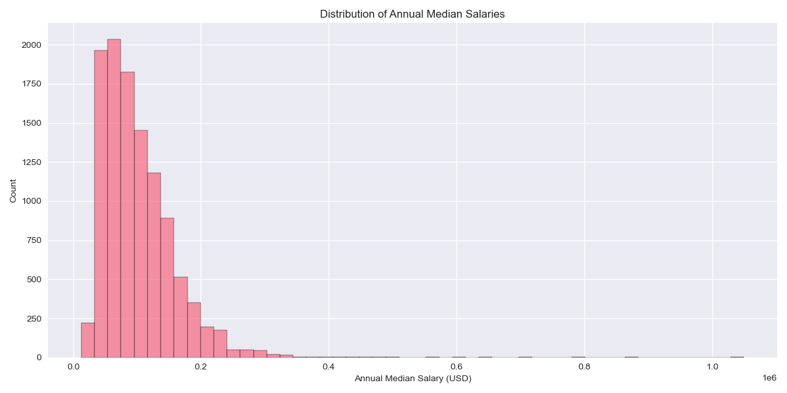
   - Median annual salary: $89,634
   - Interquartile range: $59,073 - 130,000
   - Standard deviation: $57,060
   
2. **Experience Level Impact**
   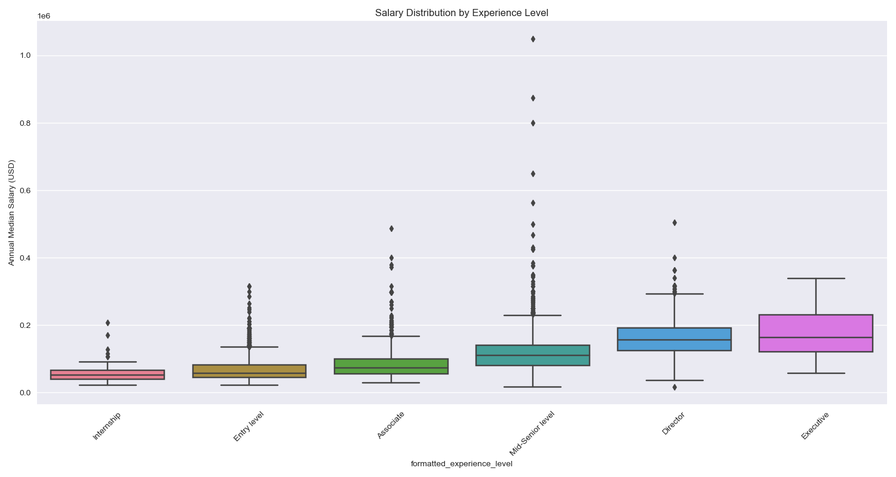
   - Clear salary progression across experience levels is observed:
     * Entry level: $69,062
     * Mid-Senior level: $115,612
     * Director: $162,099
     * Executive: $173,767
   - Mid-Senior level positions comprise the largest segment (4,150 postings)

3. **Geographic Variations**
   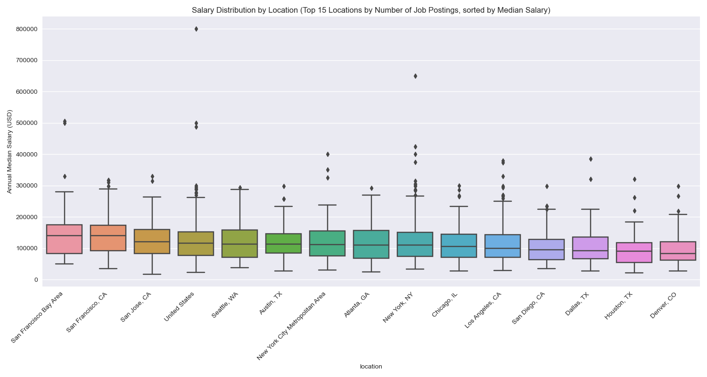
   - Highest average salaries:
     * San Francisco Bay Area: $142,967
     * San Francisco: $141,492
     * San Jose: $128,250
   - Most job postings concentrated in major tech hubs

4. **Employment Type Analysis**
   - Full-time positions dominate (9,354 postings)
   - Contract positions show competitive salaries (mean: $101,715)
   - Significant salary gap between full-time and part-time roles

Additional analyses, including detailed visualizations are available in the accompanying Jupyter notebook.

## 3. Methodology, Model Implementation, and Results

### 3.1 Approach 1: TF-IDF with Different Regressors

#### 3.1.1 Methodology and Implementation

**Feature Engineering**
The text features from job postings were processed using the following steps:
1. Concatenation of title, location, and description fields
2. TF-IDF vectorization with:
   - English stop words removal
   - Maximum of 5000 features
   - Default tokenization and preprocessing

**Model Selection and Training**
I implemented and compared four regression models:
1. Ridge Regression
2. Random Forest
3. XGBoost
4. LightGBM

Each model underwent hyperparameter tuning using 5-fold cross-validation with the following search spaces:

| Model | Hyperparameters Tuned | Best Configuration |
|-------|----------------------|-------------------|
| Ridge | alpha: [0.1, 1, 10, 100] | alpha: 0.1 |
| Random Forest | n_estimators: [100, 200]<br>max_depth: [None, 10, 20] | n_estimators: 200<br>max_depth: None |
| XGBoost | n_estimators: [100, 200]<br>learning_rate: [0.05, 0.1]<br>max_depth: [3, 6] | n_estimators: 200<br>learning_rate: 0.1<br>max_depth: 3 |
| LightGBM | n_estimators: [100, 200]<br>learning_rate: [0.05, 0.1]<br>num_leaves: [31, 62] | n_estimators: 200<br>learning_rate: 0.1<br>num_leaves: 31 |

#### 3.1.2 Performance on Synthetic Data

(Please refer to the accompanying Jupyter notebook `src/TFIDF/train_syn.ipynb` for detailed code implementation and results)

**Model Comparison**

The performance metrics for all models on the synthetic test set are:

| Model | MAE | RMSE | R² Score |
|-------|-----|------|----------|
| XGBoost | 13,957.15 | 19,825.36 | 0.977 |
| LightGBM | 15,336.03 | 23,154.65 | 0.969 |
| Ridge | 20,708.10 | 28,740.33 | 0.952 |
| Random Forest | 23,388.46 | 33,499.59 | 0.934 |

**Best Model Analysis (XGBoost)**

| Actual vs Predicted Values | Actual vs Predicted Salary Distribution |
|:-------------------------:|:------------------:|
| 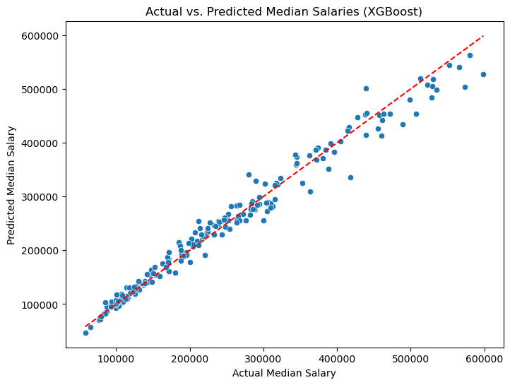 | 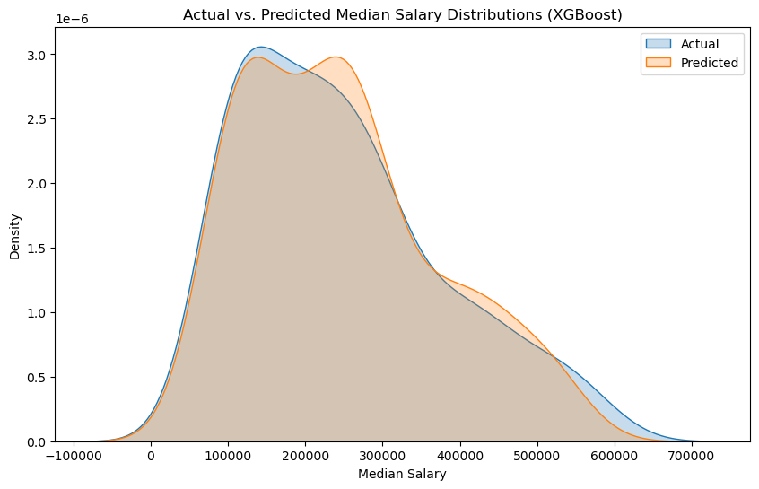 |


The XGBoost model demonstrated the strongest performance across all metrics. Key findings include:

1. Feature Importance:
   - Seniority indicators ("executive", "level") were the most influential
   - Location terms ("francisco", "austin") showed moderate importance
   - Industry-specific terms had lower but consistent impact

2. Error Analysis:
   - Mean prediction error of $13,957 (7.9% of mean salary)
   - Larger errors observed in executive-level positions
   - Relatively symmetric error distribution around zero

3. Model Limitations:
   - Increased prediction variance at higher salary ranges
   - Some sensitivity to specific keyword combinations
   - Potential overfitting to synthetic data patterns

**Performance Highlights**

The model demonstrates particularly strong performance in several scenarios:

1. Mid-Level Positions:
   ```plaintext
   Example: Mid Level Product Manager in Seattle
   Actual: $142,500
   Predicted: $139,823
   Error: $2,677 (1.9%)
   ```
   This accuracy can be attributed to the clear encoding of seniority level, location, and industry factors in the text, which closely matches our synthetic data generation rules.

2. Location-Based Adjustments:
   ```plaintext
   Example: Senior Software Engineer
   San Francisco: Predicted $185,400 (Actual: $182,000)
   Austin: Predicted $142,600 (Actual: $140,000)
   ```
   The model successfully captured the location-based salary differentials, maintaining the approximate 1.3x multiplier between San Francisco and Austin.

**Areas of Challenge**

The model faces some difficulties in specific scenarios:

1. Executive-Level Positions:
```plaintext
Example: Executive HR Generalist, San Francisco
Actual: $598,891
Predicted: $527,645
Error: $71,246 (11.9%)
```
This larger error at the executive level likely stems from:
- Greater salary variance in executive positions
- More complex interaction between skills and compensation
- Fewer training examples in the higher salary ranges

2. Cross-Domain Roles:
```plaintext
Example: Lead Data Scientist, San Francisco
Actual: $418,278
Predicted: $335,241
Error: $83,037 (19.9%)
```
The model struggled with positions that combine multiple skill domains (e.g., technical and managerial skills), suggesting that the interaction between skill categories might be more complex than our current feature representation captures.

**Validation of Synthetic Data Approach**

The strong performance on synthetic data validates the key aspects of the approach:

1. **Pattern Recognition Success**
- The high R² score (0.977) indicates that the model successfully learned the underlying salary determination rules
- The relative importance of features aligns with our data generation logic (seniority > location > industry)

2. **Validation of Data Generation Rules**
- The model's performance confirms that our synthetic data generation rules create learnable patterns
- The hierarchy of feature importance matches real-world salary determination factors
- Error analysis reveals areas where I might need to adjust our assumptions for real data

This successful validation on synthetic data supports proceeding with real data training.

#### 3.1.3 Performance on Real Data

(Please refer to the accompanying Jupyter notebook `src/TFIDF/train_real.ipynb` for detailed code implementation and results)

After validating our approach on synthetic data, I applied the same models to real LinkedIn job posting data. This section presents the results and analysis of this evaluation.

**Overall Model Performance**

The performance metrics for all models on the real test dataset are:

| Model | MAE | RMSE | R² Score |
|-------|-----|------|----------|
| Ridge | 26,100.25 | 42,805.08 | 0.500 |
| LightGBM | 25,971.77 | 43,508.56 | 0.483 |
| XGBoost | 28,704.64 | 45,568.80 | 0.433 |
| Random Forest | 29,072.44 | 47,220.77 | 0.391 |

Unlike the synthetic data where XGBoost performed best, Ridge Regression emerged as the top performer on real data. In addition the variance in performance across models is larger than observed in the synthetic data.
This shift in relative performance may suggest that:

1. Real job descriptions contain more complex and nuanced salary relationships than our synthetic data
2. Linear models (Ridge) may be more robust to the noise and variability in real-world data

**Best Model (Ridge) Detailed Analysis**

The Ridge model achieved:
- Mean Absolute Error: $26,100 (approximately 25.6% of median salary)
- R² score: 0.500
- Root Mean Squared Error: $42,805

| Actual vs Predicted Values | Actual vs Predicted Salary Distribution |
|:-------------------------:|:------------------:|
| 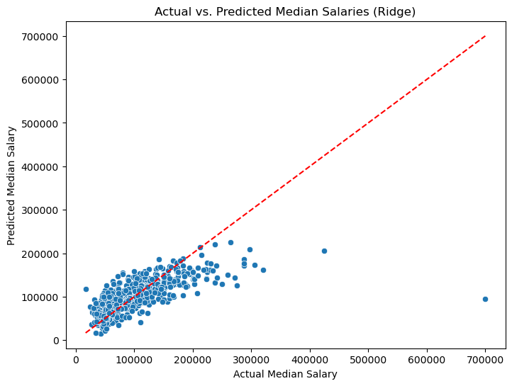 | 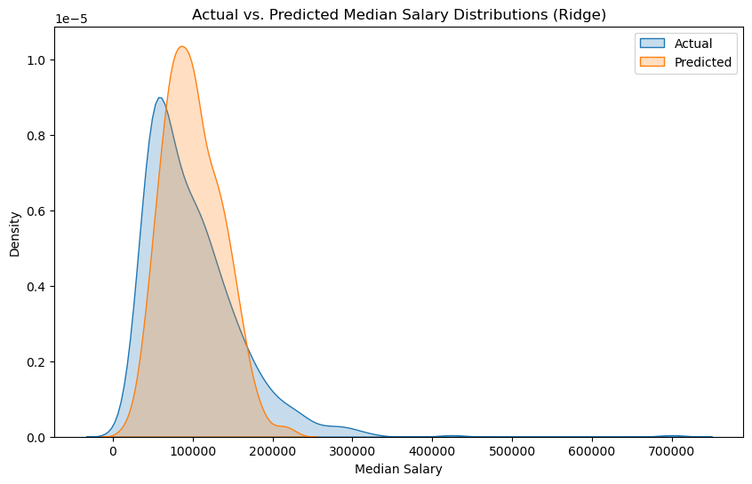 |

Key observations from the model analysis:

**Feature Importance**
   - Senior roles ("president", "vice") were significant predictors
   - Technical and legal specializations ("ip", "intellectual", "regulatory", "cloudflare", "legal") carried substantial weight
   - Location terms had less impact compared to synthetic data

**Distribution of Predictions**
   The model showed several characteristic behaviors:
   - More accurate predictions in the $75,000-150,000 range
   - Tendency to underpredict very high salaries (>$300,000)
   - More conservative predictions compared to synthetic data

**Error Analysis**

*Areas of Strong Performance:*
- Mid-level technical roles
- Standard corporate positions
- Jobs with clear title hierarchies

*Areas of Challenge:*

The largest prediction errors occurred in:
- Medical specialists with complex compensation structures
- Roles with significant bonus components
- Executive positions with variable compensation

Examples of challenging predictions include:
```plaintext
Example: Urologist
Text: Urologist Baltimore, MD Location: DC/Baltimore Salary: Highly competitive base salary exceeds MGMA plus production + RVU structure Employment Type: Full-time, Partnership opportunity Position Available: Urologist Start date: 2023 - 2024 Overview: Due to expansion, Healthcare United is seeking a BE/BC General Urologist needed to join a well-established, physician-owned group with locations throughout the DC/Baltimore Metroplex. Group has several new ASC's & State-of-the-art OR suites Must be Board-Eligible with strong professional references Monday-Friday schedule, 8 AM - 5 PM Light call schedule Mentorship available for recently-trained Urologists Competitive compensation, plus RVU's Sign-on bonus Relocation assistance Very collegial environment This opportunity offers full autonomy with the practicing physicians. Clinicalsupport staff works adjacently with the Urologists including Scribe's, Medical Assistant's, Registered Nurses, and NP's. Call is taken by the NP and PA on staff. Additional call support is covered by Fellowship's within the Academic pr
ograms in the area.
Actual: $700,000
Predicted: $94,261
Error: $605,739 (86.5%)
```

**Comparison with Synthetic Data Performance**

The transition from synthetic to real data revealed several important insights:

1. **Performance Gap**
   - R² dropped from 0.977 (synthetic) to 0.500 (real)
   - RMSE increased by approximately 2.2x
   - MAE increased by approximately 1.9x

2. **Validation of Assumptions**
   - Confirmed importance of seniority indicators
   - Validated role-based and industry-related salary differentiation (e.g., technical vs. managerial, healthcare / technology vs. retail)
   - Demonstrated less impact of location than assumed

3. **Areas for Improvement**
   - Need for better handling of variable compensation
   - More sophisticated modeling of industry-specific salary structures
   - Better representation of specialized professional roles

These results suggest that while our synthetic data provided a good starting point for model development, real-world salary prediction requires additional consideration of:
- More complex compensation structures (e.g., variable bonuses, equity)
- Industry-specific salary patterns
- Specialized professional roles

### 3.2 Approach 2: Fine-tuning a Transformer Model

#### 3.2.1 Methodology and Implementation

For our second approach, I explored the potential of leveraging large language models (LLMs) through fine-tuning. This approach differs fundamentally from the TF-IDF based methods by utilizing pre-trained language understanding to capture more nuanced relationships between job descriptions and salaries.

**Data Preparation**

- Structured each training example as a conversation with three components:
   * System message defining the task
   * User message containing job detail texts (title, location, description)
   * Assistant message containing the target salary
- Maintained consistent formatting across all examples to ensure model learning

**Fine-tuning Process**

- 80/20 split for training and validation data
- Base Model: GPT-4o-mini
- Training Configuration:
  - 3 epochs
  - learning rate: auto
  - batch size: 1

**Fine-tuning Results**
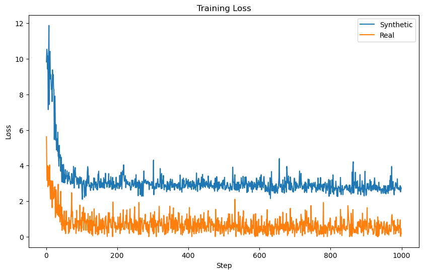
- Both datasets showed rapid initial learning (first 100 steps) and stable convergence without signs of overfitting
- Synthetic data stabilized at a higher loss (2.5-3.0) while real data converged at a lower loss (0.5-1.0)
  - The reason for this might be: in the synthetic data generation process, the salary is a function of multiple factors, leading to more non-zero digits in salary (e.g. $123,456.78). This makes the task inherently more difficult for the model to predict precise values. While in the real data, the salary is more rounded and has more ending zeros (e.g. $120,000), making it easier for the model to predict.
- Real data achieved lower loss but with higher variance
  - The spiky pattern suggests more variability in the underlying data, which makes sense given real job postings have less consistent patterns than synthetic ones.

#### 3.2.2 Performance on Synthetic Data

The transformer-based model demonstrated excellent performance on synthetic data, achieving high accuracy metrics:
- Mean Absolute Error (MAE): $11,342.29
- Root Mean Squared Error (RMSE): $16,283.67
- Mean Absolute Percentage Error (MAPE): 4.52%
- R² Score: 0.985

| Actual vs Predicted Values | Actual vs Predicted Salary Distribution |
|:-------------------------:|:------------------:|
| 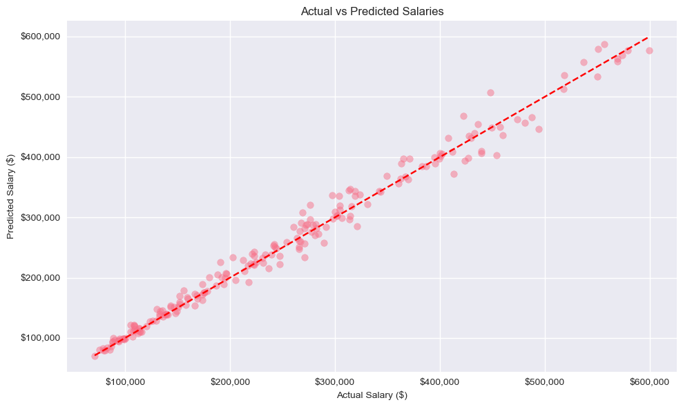 | 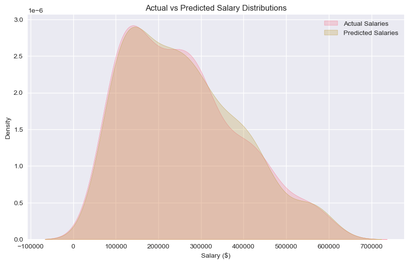 |

The error distribution analysis reveals several key characteristics:
   - Nearly symmetric error distribution centered at zero
   - Error magnitude shows a slight increase with salary level

#### 3.2.3 Performance on Real Data

The model's performance on real data is also strong, with the following metrics:
- Mean Absolute Error (MAE): $8,112.31
- Root Mean Squared Error (RMSE): $20,158.36
- Mean Absolute Percentage Error (MAPE): 8.10%
- R² Score: 0.866

| Actual vs Predicted Values | Actual vs Predicted Salary Distribution |
|:-------------------------:|:------------------:|
| 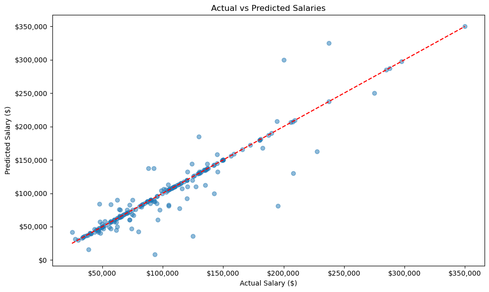 | 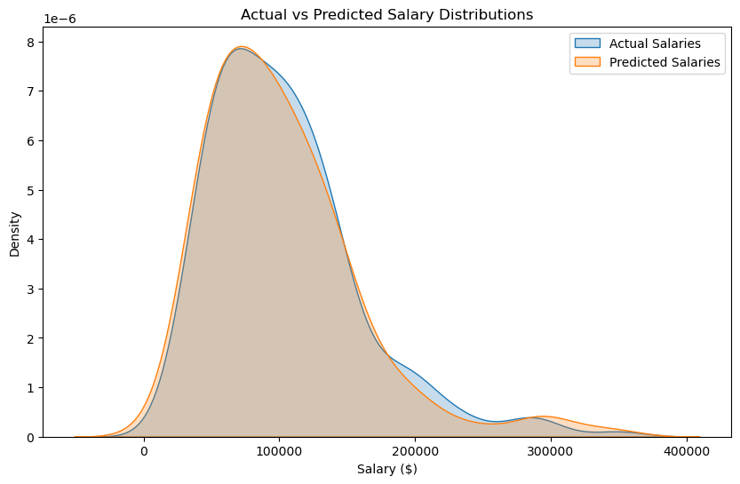 |


**Areas of Strong and Poor Performance**

The model excelled in predicting salaries for:
- Roles with explicit compensation information in the description
- Mid-level standard corporate positions

For example:
```plaintext
Input: "Job Title: Business Law Attorney\nLocation: Denver, CO\nDescription:  A Colorado boutique law firm, Childs McCune LLC, has an opening in both our Denver and Colorado Springs offices for a business law associate position with 2-8 years of experience, preferably in health law. The ideal candidate will have the skills to prepare health practice governance and employment agreements, counsel on risk management, assist on health billing cases, and generally act as outside counsel to various healthcare entities. Preference will be given to those applicants who are strong in legal research, persuasive legal writing, and accomplished stand-up skills. The firm\u2019s attorneys are active in the Colorado legal community and value leadership, professional involvement, community presence, and charity work. A one-on-one mentor program is offered through the firm. The salary range is $120,000 to $165,000, depending upon qualifications, experience, and other considerations permitted by law. There is an opportunity to become a firm Member. \nBenefits include health/dental/vision insurance, a 401k, life/disability insurance, and the potential for an annual bonus. Please send a cover letter, resume, references, and a writing sample to Jordan Lipp at jlipp@childsmccune.com\nNo agencies please. ",
Actual: 142500.0,
Predicted: 142500.0,
```

This example demonstrates the model's ability to accurately infer the salary when explicit compensation information (in this case the min and max salary range) is present in the job description.

However, the model struggled with:
- Larger errors in niche or specialized roles: Government IT Specialist, VP HR at bank, Travel Nurse
- Senior executive positions with non-standard compensation structures and more variable salary ranges
- Part-time or contract roles with more flexible hours, and hard to predict annual salary

For example, the model didn't perform well on this VP HR role:
```plaintext
Input: Job Title: Vice President Human Resources\nLocation: New York City Metropolitan Area\nDescription: ***Our client is a Bank in Manhattan seeking a VP of HR***\nSpecific duties include but are not limited to:· Develop and implement a framework for all HR-related operations· Handle strategic efforts for the entire firm· Create policies and procedures for grievances, conflicts, and problem resolution· Schedule, attend, and document annual employee reviews· Oversee and train a small to midsize team, while establishing and maintaining guidelines\nJob Requirements:· 12+ years of HR experience· Must have Financial Services Experience· Bachelor’s degree is required
Actual: $237,500.00
Predicted: $325,000.00
Absolute Error: $87,500.00
Percentage Error: 36.84%
```

**Synthetic vs Real Data Performance Comparison**:

1. **Accuracy Metrics**:
   - Lower overall error (MAE) on real data (8,112 vs 11,342)
   - Higher MAPE on real data (8.10% vs 4.52%)
   - Lower R² score on real data (0.866 vs 0.985)

2. **Error Distribution**:
   | Synthetic Data Error Distribution | Real Data Error Distribution |
   |:-------------------------:|:------------------:|
   | 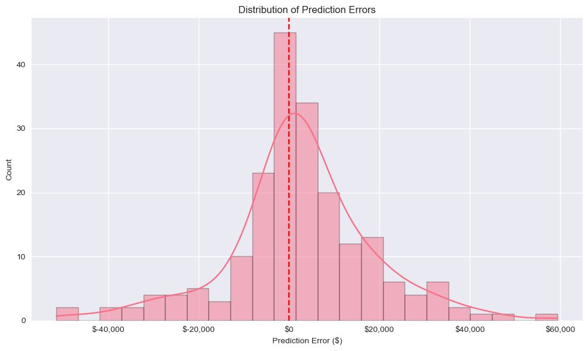 | 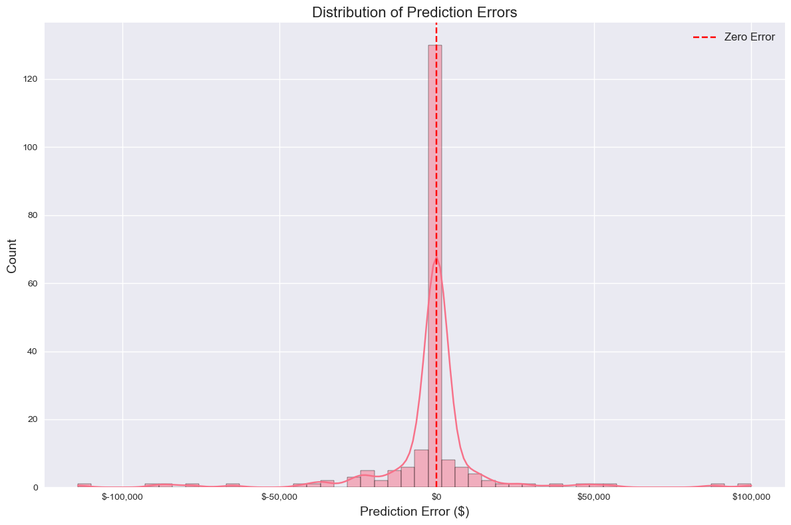 |
   - Synthetic data errors are more symmetric and uniformly distributed; Real data errors show a sharper peak around zero
     - This is because some job postings contain explicit compensation information. And gpt-4o-mini effectively extracts and processes structured salary information within descriptions, leading to more accurate predictions when explicit salary data is present.
   - Real data errors exibit more extreme outliers
     - This reflects the inherent variability of real-world salary structures, which are harder to capture

These results demonstrate that while the model performs well on both synthetic and real data, it adapts its prediction strategy based on the information available in the job description. The higher variance in real data predictions reflects the inherent complexity and variability of real-world salary structures, while the lower MAE suggests effective handling of explicit salary information when available.

## 4. Comparison of Approaches

### 4.1 Performance Metrics

| Approach                  | Dataset       | MAE         | RMSE        | R² Score  | MAPE       |
|---------------------------|---------------|-------------|-------------|-----------|------------|
| TF-IDF (Best: Ridge)      | Synthetic     | $20,708.10  | $28,740.33  | 0.952     | 10.21%     |
|                          | Real          | $26,100.25  | $42,805.08  | 0.500     | 25.6%      |
| Fine-Tuned Transformer    | Synthetic     | $11,342.29  | $16,283.67  | 0.985     | 4.52%      |
|                          | Real          | $8,112.31   | $20,158.36  | 0.866     | 8.10%      |

On the real LinkedIn job postings dataset, the fine-tuned transformer model significantly outperformed the TF-IDF-based models. The transformer model achieved a much lower MAE and RMSE, and a substantially higher R² score, indicating a better fit to the real-world data. This performance gap highlights the transformer model's superior ability to handle the complexity and variability inherent in real job descriptions and salary structures.

### 4.2 Analysis of Model Capabilities

#### 4.2.1 Handling of Textual Data

**TF-IDF with Regressors**

The TF-IDF approach converts text into a sparse numerical representation based on word frequency, treating each word independently (bag-of-words model). While this method captures the importance of individual words, it does not account for word order or context. Consequently, TF-IDF models may struggle to capture nuanced language patterns or extract meaningful information from complex job descriptions.

**Fine-tuned Transformer Model**

The transformer model, leveraging pre-trained language understanding, can comprehend the context and relationships between words in the text. It captures semantic meaning, handles long-range dependencies, and processes the syntactic structure of sentences. This allows the model to extract richer features from the job descriptions, including implicit salary indicators and the interplay between different job attributes.

#### 4.2.2 Extraction of Explicit Salary Information

**TF-IDF with Regressors**

TF-IDF models do not inherently recognize numerical values or extract specific patterns like explicit salary mentions within the text. They treat all words equally after vectorization, potentially missing critical information when salaries are mentioned directly in the job description.

**Fine-tuned Transformer Model**

The transformer model demonstrated an ability to extract explicit salary information from job descriptions when present. By understanding the context and recognizing numerical patterns, the model could directly incorporate this information into its predictions, leading to more accurate salary estimates in cases where the salary is mentioned in the text.

#### 4.2.3 Generalization to Real-World Data

**TF-IDF with Regressors**

The performance of TF-IDF models dropped significantly when moving from synthetic to real data, with the R² score decreasing from 0.977 to 0.500. This indicates a limited ability to generalize from controlled, pattern-rich synthetic data to the more variable and complex real-world data. The models may be overfitting to the specific patterns in the synthetic dataset and lack the flexibility to handle the diversity of real job postings.

**Fine-tuned Transformer Model**

The transformer model maintained strong performance when transitioning from synthetic to real data, with only a slight decrease in R² score from 0.985 to 0.866. This suggests a robust ability to generalize and adapt to the complexities of real-world data. The model's deep language understanding enables it to handle diverse job descriptions and extract relevant salary-related information effectively.

### 4.3 Computational Complexity and Training Efficiency

**TF-IDF with Regressors**
I've trained the models with a M2 MacBook Air with 16GB RAM and 8-core CPU. The training time for each model is as follows for real data (11,014 job postings):
- Ridge Regression: ~10 seconds
- Random Forest: ~15 minute
- XGBoost: ~20 minute
- LightGBM: ~20 minute

The TF-IDF models are relatively simple and computationally efficient. The feature extraction process is straightforward, and training linear models like Ridge Regression is fast even on large datasets. Ensemble models like XGBoost and Random Forest require more computational resources but are still manageable.

**Fine-tuned Transformer Model**
The fine-tuning process for gpt-4o-mini was conducted via OpenAI's API, which utilizes OpenAI's more powerful GPU resources. The training time was approximately 1 hour for 3 epochs on the synthetic dataset and 2 hours for the real dataset. 

Fine-tuning a transformer model is much more computationally intensive, and hard to do on a personal computer. It requires access to powerful GPUs or cloud-based resources to handle the large-scale language model training.

## 5. Conclusion

Overall, the fine-tuned transformer model outperforms the TF-IDF-based models across most evaluation metrics, particularly in the context of real-world data. The transformer's ability to comprehend context, extract explicit salary information, and generalize to diverse job postings makes it a more effective tool for salary prediction from unstructured text. However, this comes at the cost of increased computational requirements and reduced interpretability.

The TF-IDF models, while simpler and more interpretable, are limited by their inability to capture the complexity of natural language and the nuances of salary determination in real job descriptions. They may still be useful in scenarios where computational resources are limited or where model interpretability is a priority.
