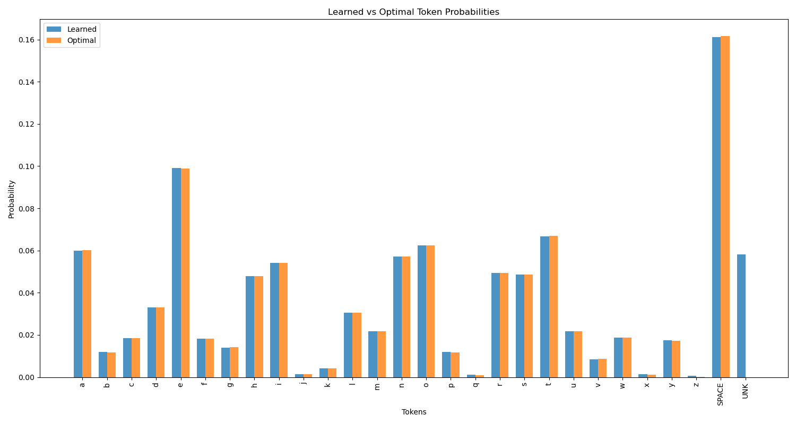
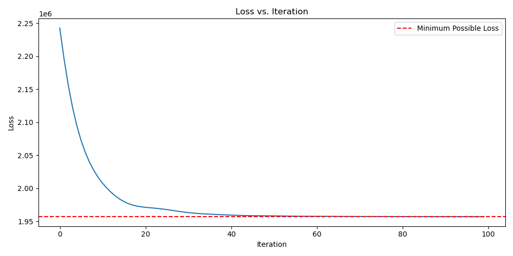

### Explanation of Neural Network Implementation

This neural network implements a unigram language model using PyTorch. 

1. Inputs:
   The input to the model is a one-hot encoded representation of text tokens. Each token (character) is represented as a vector of length 28 (vocabulary size), where only one element is 1 and the rest are 0.

2. Outputs:
   The output of the model is a scalar value representing the total log-likelihood of the input sequence under the unigram model. It's calculated as the dot product of token counts and log-probabilities: (1 x V) counts vector transposed and multiplied by (V x 1) log-probabilities vector.

3. Model Structure:
   The model consists of a single layer of weights 's' (initialized uniformly) which are then transformed into a probability distribution using the LogSoftmax function.

4. Learning Process:
   - The model learns the parameter 's' which represents the log-probabilities of each token in the vocabulary.
   - It uses gradient descent (the Adam optimizer) to minimize the negative log-likelihood of the training data.

The learned function essentially maps from a sequence of one-hot encoded tokens to a scalar representing the log probability of that sequence under the unigram model. In other words, it learns the frequency distribution of characters in the training text.

This implementation aligns with the course content on unigram models and the use of neural networks for NLP tasks, as covered in lectures 2 (Unigram Model), 7 (Gradient Descent), and 8 (Neural Networks). 

### Description of Visualizations

1. Final Token Probabilities vs Optimal Probabilities:

    Key observations:
    - The learned probabilities (blue bars) closely match the optimal probabilities (orange bars) for most tokens, indicating that the model has successfully learned the underlying distribution of the text.
    - The most common token appears to be the space character ("SPACE"), with a probability of about 0.16 or 16%.
    - Letters like 'e', 't', 'a', and 'o' have higher probabilities, which is consistent with typical English letter frequencies.
    - The "UNK" (unknown) token has a small non-zero probability in the learned model, while it has zero probability in the optimal distribution. This slight discrepancy is likely due to the model's initialization and training process, which doesn't push probabilities exactly to zero.
    - Overall, the model has captured the relative frequencies of characters in the text very accurately, with only minor differences between learned and optimal probabilities.

2. Loss vs. Iterations:

    Key observations:
    - The loss starts high (around 2.25 x 10^6) and rapidly decreases in the first few iterations, indicating that the model quickly learns a good approximation of the token distribution.
    - After the initial rapid decrease, the loss continues to decline more gradually, approaching the minimum possible loss (indicated by the red dashed line).
    - By around iteration 50-60, the model's loss is very close to the minimum possible loss, suggesting that the model has effectively converged.
    - The smooth decrease in loss without significant fluctuations suggests that the chosen learning rate and optimization method (Adam) are well-suited for this task.

### Description of Modifying the Code for Document Classification

1. Training Data: Instead of a single large text, we need a dataset of multiple documents, each associated with a label (e.g., topic categories, sentiment classes).

2. Tokenization: For each document, tokenize it into words probably makes more sense than characters. 

3. Adjusting Model: From a unigram probability estimator to a document classifier with a linear or multi-layer architecture. For the forward pass
   - Input Shape: Each input is a feature vector representing a document (e.g., token counts), of shape (V,).
   - Output: The raw logits for each class, which can be converted to probabilities using Softmax.

4. Loss Function: Instead of maximizing probability, we can use cross-entropy loss between the predicted class probabilities and the true labels.

5. Training Function: Modify the training function to work with batches and the new loss function:

